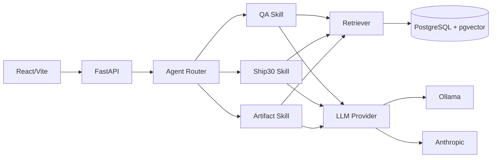

# Architecture

## Data model
`users → sessions → messages`; `documents → chunks`; `sessions → artifacts`. Chunks store vectors and traceable document metadata. Artifacts store generated content plus source records.

## RAG pipeline
Ingestion → YAML metadata parse → paragraph-aware chunking → embedding → pgvector. Query → embedding → cosine-distance top-K → threshold → context assembly → provider → citations.

## Session management
All message reads/writes are keyed by session ID and the single local user's ID. The service loads only the current session's history.

## Security
Retrieved transcript content is untrusted reference data. The model prompt separates instructions from reference material. HTML is sanitized server-side and rendered in a sandboxed iframe client-side. No user input is executed as shell/code.

## Failure handling
Ollama failures become structured 503 errors; the frontend retains the application shell and displays the model-unavailable state. Database failures produce degraded health rather than a false healthy status.

## Scaling
For larger workloads, add authentication/tenant boundaries, async ingestion workers, hybrid search, reranking, model queues, connection pooling, and distributed tracing.
